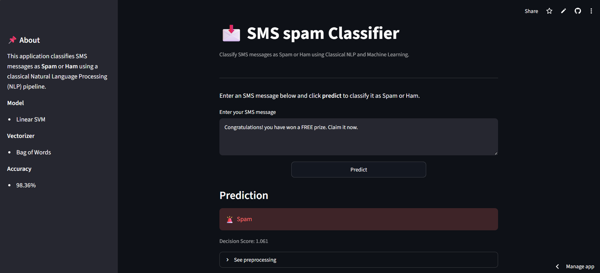

# 📩 SMS Spam Classifier

An end-to-end Natural Language Processing (NLP) application that classifies SMS messages as **Spam** or **Ham** using Classical NLP techniques and Machine Learning.

The project includes the complete ML workflow—from data preprocessing and exploratory data analysis (EDA) to model training, evaluation, and deployment using Streamlit.

---

## 🌐 Live Demo

🔗 https://roshan-spam-classifier.streamlit.app

---

## 📷 Application Preview

> <p align="center">
  
</p>

---

## ✨ Features

- Classifies SMS messages as **Spam** or **Ham**
- Interactive web interface built with Streamlit
- Text preprocessing pipeline
- Multiple machine learning models compared
- Best model saved using Pickle
- Real-time prediction
- Displays decision score
- Fully deployed and publicly accessible

---

## 📂 Project Structure

```text
sms-spam-classifier/
│
├── assets/
│   └── app_preview.png          # Screenshot of the deployed application
│
├── data/
│   └── spam.csv                 # SMS Spam Collection dataset
│
├── models/
│   ├── spam_model.pkl           # Trained Linear SVM model
│   └── vectorizer.pkl           # Trained CountVectorizer
│
├── notebooks/
│   └── spam_classifier_cleaned.ipynb   # Complete EDA, preprocessing and model training
│
├── app.py                       # Streamlit web application
├── utils.py                     # Text preprocessing utilities
├── requirements.txt             # Project dependencies
├── README.md
└── .gitignore
```

## 🛠️ Technologies Used

- Python
- Pandas
- NumPy
- NLTK
- Scikit-learn
- Streamlit
- Git & GitHub

---

## 📖 NLP Pipeline

Each SMS message undergoes the following preprocessing steps:

- Convert text to lowercase
- Tokenization
- Remove non-alphanumeric characters
- Remove stopwords
- Apply Porter Stemming

---

## 📊 Text Representation

The following feature extraction techniques were compared:

- Bag of Words (CountVectorizer)
- TF-IDF (TfidfVectorizer)

---

## 🤖 Models Evaluated

- Multinomial Naive Bayes
- Logistic Regression
- Linear Support Vector Machine (Linear SVM)
- Decision Tree
- Random Forest

---

## 🏆 Best Performing Model

| Component | Selection |
|-----------|-----------|
| Text Representation | Bag of Words |
| Classifier | Linear SVM |
| Accuracy | **98.36%** |
| Precision | **99.23%** |
| Recall | **88.97%** |
| F1 Score | **93.82%** |

---

## 🚀 Installation

Clone the repository

```bash
git clone https://github.com/roshanchouhan-ai/sms-spam-classifier.git
```

Move into the project directory

```bash
cd sms-spam-classifier
```

Install the required packages

```bash
pip install -r requirements.txt
```

Run the Streamlit application

```bash
streamlit run app.py
```

---

## 📌 Example Predictions

| SMS Message | Prediction |
|-------------|------------|
| Hey, are we meeting tomorrow? | ✅ Ham |
| URGENT! Claim your prize now! | 🚨 Spam |
| Congratulations! You've won a FREE ticket! | 🚨 Spam |

---

## 📈 Future Improvements

- Add probability/confidence visualization
- Support multilingual SMS classification
- Deploy using Docker
- Experiment with Word2Vec, FastText and BERT embeddings
- Compare with Deep Learning models

---

## 👨‍💻 Author

**Roshan Chouhan**

GitHub: https://github.com/roshanchouhan-ai

---

## ⭐ If you found this project useful, consider giving it a star!